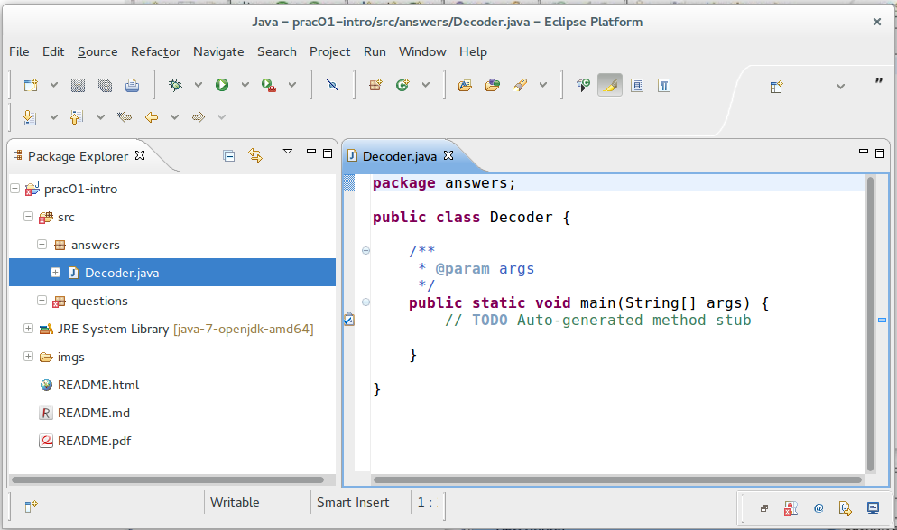

CAB302 Software Development
===========================

# Practical 1: Introducing Java and Eclipse

This week's practical exercises aim to get you familiar with writing and debugging simple Java programs using the Eclipse integrated development environment.

* * *

## Exercise 0: Getting Started
Text resources for this practical are available on Blackboard via CAB302->Learning Resources->Help Guides and Other Resources. Links to windows executables for Eclipse and other programmes can also be found on Blackboard via CAB302->Learning Resources->Windows Software.

Consult the [_Software Environment Handbook_] on Blackboard for instructions on how to install __Java__ and __Eclipse__ on your own computer, or follow your tutor's instructions for how to use a version on the lab machines.

When you first start Eclipse you will see a splash screen. This may be followed by a request to choose your _workspace_, or a default may be used. The workspace is the folder where Eclipse will store your files. If you want to save your work for later you should choose a location from which you can retrieve the files easily afterwards, such as your home drive or a memory stick. To change the (current or default) workspace go to `File > Switch Workspace`.

When Eclipse is started for the first time you will see a Welcome screen similar to the one below (this is Indigo EE; yours may be different as they may change slightly with each release). The big arrow on the right will enter an Eclipse development session in your selected workspace.

Explore the various buttons and options available. In particular, make sure you know
how to:

* switch perspectives (especially `Java` and `Debug` );
* minimise and maximise _views_ (subwindows);
* delete and recover views (via the `Window > Show View` pulldown menu);
* detach views from the workbench as free-floating windows and dock them again (by right-clicking the label and un/selecting `Detached`);
* create a project, package and class ; and
* create new workspaces (by 'switching workspaces' to `Other`).

Now, import the Practical 1 project into your Eclipse workspace following the [_Git for Pracs_] instructions on Blackboard.

* * *

## Exercise 1: A message decoder

As a first exercise involving iteration and console output in Java you will develop a small program to decode a secret message. In the `prac01-intro` project, create a new _package_ (e.g., '`answers`'). Then create a new _class_ called '`Decoder`', making sure that you check the box for a:

    public static void main(String[] args)

method stub (or you can enter this text later in the editor).

You should now see an editing window with an empty program template something like this:

The challenge from this point is to create a program which will decode a "secret message". The message is encoded as an array of numbers, declared as the following constant:

    /* The secret message */
    final int[] message = { 82, 96, 103, 103, 27, 95, 106, 105, 96, 28 };

It can be unlocked with a particular key, declared as follows:

    /* The key for unlocking the message */
    final int key = 5;

Copy these two declarations into your main program. Then, to unlock the message, you need to write Java code that will:

1. add the key to each number in the message;
2. convert each number in the message to its equivalent character representation (most easily done by type-casting the numbers to __`char`__ type); and
3. print each of the resulting characters (which is most easily done using method `System.out.print()`, [other methods of `System.out` are listed here](http://docs.oracle.com/javase/7/docs/api/java/io/PrintStream.html#method_summary)).

Ask your tutor if you're not sure how to do any of these things.

As you edit your program, take note of how Eclipse generates error and warning messages for incomplete or incorrect code segments. In particular, try out the 'quick fix' feature by right-clicking on an error or warning icon , and select a suitable
solution for your problem, if one is available.

**Hint:** As usual when programming, _think_ before you type. This exercise can be solved very concisely.

**Hint:** This is a good opportunity to use a 'for each' loop.

**Extra exercise:** If time permits, develop a corresponding 'encoder' program that prints a string as a sequence of numbers. This time the key should be _subtracted_ from the number corresponding to each character. You may find a helpful method or two in Java's `String` class -- look it up in the [Java API Specification](http://docs.oracle.com/javase/7/docs/api/). (You'll be spending a lot of time browsing this document in coming weeks!)

* * *

## Exercise 2: Debugging a 'summation' program

This exercise will give you practice in using Eclipse's debugger. Get the Java program `Summation.java` (it is part of the Git repository that contained this file). This program is meant to calculate the sum of the natural numbers in a given range. The range is expressed by constants for the starting and finishing numbers, inclusive. Recall, for instance that the sum of `i` over 1<=`i`<=5 is 15.

Load the program into your project, either: by copying it directly into your Eclipse workspace using your operating system's file browser and alerting Eclipse to the change (via `File > Refresh`); by creating a new class and copying the program text into Eclipse's Java editor; or by dragging it from the file browser into the package in Eclipse. (No matter how you do it, make sure that the __`package`__ declaration at the beginning of the program matches the name of your package, otherwise you will get a
compilation error.)

**(a)** Run the program with a `START` value of 1 and an `END` value of 5. Is the answer what you expected? Use Eclipse's debugging perspective  to examine the program's behaviour as it executes. In the add method double click in the grey bar just to the left of the __`for`__ loop statement. This adds a _breakpoint_  to the application. Now 'debug' rather than 'run' the program. You will be able to control the program's execution using the various debugging buttons . Step through the program and watch how variables `index` and `total` change. By doing this you should be able to spot and fix the coding error.

**Note:** If you hover the cursor over a variable when the program is stopped the variable's value is displayed.

**Note:** If you want to observe the behaviour of code in a '`main`' method, make sure that the '`Stop in main`' box is checked under `Run > Debug Configurations`.

**(b)** Having corrected the error in the program, now change the value of constant `END` to 1000. Run the program. Does the answer look correct? Go back into the debugging perspective and see if you can identify and fix this new problem. (This may require some patience!)

* * *

## Exercise 3: A 'decision making' method

This exercise will give you practice at writing a subroutine (method) in Java involving a conditional (__`if`__ or __`switch`__) statement. Quadcharts are a commonly-used technique for making decisions involving two independent variables. For instance, the following quadchart suggests the response you should make when asked by your boss to complete a job, given its level of difficulty and expected duration.

.  | **Easy Job** | **Hard Job**
--:|:----------:|:---------:
**Short Deadline** | Discuss | Decline
**Long Deadline** | Accept | Discuss

If the job is easy and there is plenty of time to complete it you should accept. If the job is hard and there is very little time you should decline. If the job is easy but the deadline is short you should negotiate for an extension of time. If there is plenty of time to complete the work but the job is hard you should negotiate for more staff.

As a management aid, your task is to define a function that accepts estimates of a job's duration (in months) and difficulty (on a scale of 1 to 10) and returns a string indicating which of the three possible responses you should make, "`accept`", "`decline`" or "`discuss`". ___Jobs with a duration of three months or less are considered 'short' and jobs with a difficulty level of seven or more are considered
'hard'___. (To simplify the solution you can hardwire these values as constants into your
program, although this is not normally good programming practice.)

To start, get the Java file `DecisionMaker.java` from the repository. This program template contains a '`main`' method which serves to test the desired `decision` method. Your task is to complete the program by writing the missing `decision` method so that the program produces the results 'accept', 'decline', 'discuss' and 'discuss' for the four proposed projects, respectively. (Later in this unit we will introduce a far more systematic way of testing programs.)

**Observation:** This exercise is good practice at writing conditional statements. Making a three-way decision based on two variables is awkward, no matter how it's coded.
